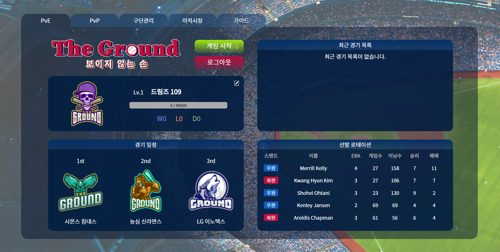

# ⚾ 나와 : 나와 잘맞는 동네 운동 메이트를 찾는 플랫폼

## 📜 설명

자신만의 드림팀을 구성하고 전략적 시뮬레이션 게임을 할 수 있는 실제 선수 데이터 기반의 야구 시뮬레이션 웹게임 서비스입니다.

## 🗓️ 개발 기간

2022.08.29 ~ 2022.10.07

## 💡 주요 기능
- 제한된 예산에서 마음에 드는 선수들을 자유롭게 이동하여 팀구성을 할 수 있는 **선수 이적 시장**
- 본격적인 게임에 앞서 보유 타자 선수들로 상대의 선발 투수 등에 따라 고려해 순서를 지정할 수 있는 **타자 타선 지정**
- 앞전에 설정된 라인업을 통해 실시간 다양한 게임 현황을 확인할 수 있는 **야구 시뮬레이션**
- 시뮬레이션 도중 다양한 전략적 플레이를 위한 **선수 교체**

## 🛠️ 기술 스택

- React, Javascript, Redux, Axios
- SpringBoot, Java, JPA
- AWS EC2, Jenkins, Nginx, Docker
- MySQL, Hadoop

## 📚 라이브러리

- 프론트엔드
    |이름|버전|적용|
    |---|---|---|
    |nivo|^0.80.0|선수 데이터 그래프로 시각화|
    |react-redux|^8.0.2|데이터 상태 관리|
    |react-axios|^2.0.6|서버와의 API 통신|
    |react-bootstrap|^2.5.0|컴포넌트 디자인 구조|
    |react-dnd|16.0.1|특정 컴포넌트 마우스 드래그 앤 드랍 기능 구현|
    |react-howler|^5.2.0|내용|
    |react-icons|^4.4.0|디자인적인 아이콘 적용|
    |react-scripts|^5.0.1|내용|
    |react-persist|^6.0.0|페이지 새로고침시 휘발되는 state 방지|
    |react-vitals|^2.1.4|내용|
- 백엔드
    |이름|버전|적용|
    |---|---|---|
    ||||

## 👥 멤버

- 프론트엔드
    - 이정재
    - 홍성목
- 백엔드
    - 김주원
    - 이대희
    - 이호승

## **🔗 자세한 내용**

- [The Ground : 보이지 않는 손](https://gaudy-veil-46f.notion.site/The-Ground-a21accf657914deda3c494fbaa347cb1)
